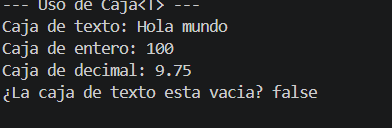
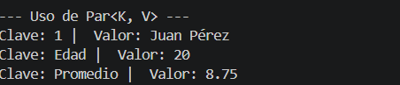

# icc-est-u2-Generico
## Datos del Estudiante
- **Nombre:** Ariel de Jesus Ushca Zambrano
- **Id:** 0707297123
- **Curso:** Estructura de datos
- **Fecha:** 6/3/2026

---

## 1. Implementación de Caja<T> y Par<K, V>

**Fecha:** 6/3/2026
**Descripción:** En esta práctica se implementaron las clases genéricas Caja<T> y Par<K, V> dentro del paquete models. La clase Caja<T> permite almacenar y obtener un dato de cualquier tipo, mientras que la clase Par<K, V> permite representar una relación entre una clave y un valor. En la captura se muestra la ejecución del programa en consola con diferentes tipos de datos.

![Captura de salida en consola]
![Captura de salida en consola]
